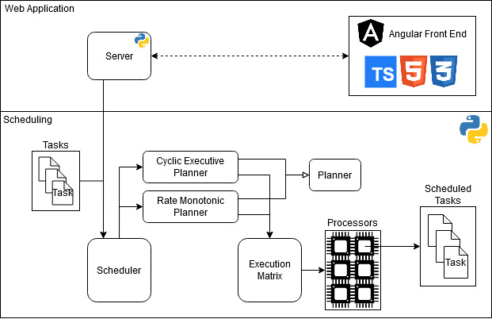

# Sistemas de Tiempo Real - Tp Final
## Programador de tareas para un sistema de tiempo real
**Gabriel Martín Moran y Oscar Andrés Argueyo**

## Configuración de ambiente
### Back End Python

#### Instalación de dependencias
Para poder correr la solución, es necesario primero instalar las dependencias de python (en nuestro caso estamos utilizando Python 3.8.x)
Para poder instalar las librerías necesarias puede ejecutarse el siguiente comando (teniendo el instalador de paquetes ***pip*** instalado y estando parados en el root del repositorio).

    pip install -r ./requirements.txt

#### Ejecución del Back End
Luego de haber instalado las dependencias, con el siguiente comando se iniciará la aplicación, la cual abrira un browser redireccionando a donde se encuentra hosteada la aplicación en su versión local.

    python ./run.py

### Front End Angular 
*La instalación de Angular solamente es necesaria en caso de querer modificar el Front End. Si la intención es solamente correr la aplicación, con la configuración de ambiente del Back End es suficiente, ya que se provee un complilado del Front End en el mismo*
#### Instalación de dependencias
En caso de querer modificar el Front End realizado en Angular 10, se deben seguir los siguientes pasos:

 1. Instalar ***nodejs***: https://nodejs.org/es/download/
 2. Instalar ***npm*** (en caso de que la version de ***nodejs*** no lo traiga por defecto)
 3. Instalar ***Angular***: https://cli.angular.io/
 4. Navegar al directorio **rt-scheduler-frontend** del repositorio y ejecutar el comando:

	    npm install
 
#### Instalación de dependencias
 1. Navegar al directorio **rt-scheduler-frontend** del repositorio
 2. Una vez en el directorio del proyecto de Angular, ejecutar el siguiente comando para iniciar el servidor de desarrollo:

	    ng serve

 3. Cuando la aplicación haya compilado, abrir un browser y navegar a la URL: *http://localhost:4200*

#### Compilación del Front End
Cuando se hayan realizado los cambios deseados, para compilar el proyecto de Front End se debe ejecutar el comando:

    ng build --prod

Al finalizar la compilación, el resultado de la misma se encontrará en el directorio **rt-scheduler-frontend/dist/rt-scheduler-frontend** del repositorio.
Para que el Back End en Python devuelva el resultado de la compilación al navegar la URL que este expone, se debe eliminar todo el contenido de la carpeta **src/client** del repositorio y copiar el resultado de la compilación realizada anteriormente en este directorio.

## Documentación

* Notas sobre el tp, mientras se modela y codifica:
https://docs.google.com/document/d/1qxj6kagK2cWqGhYokpsoumGQa5uaegwg5av3DhRLsSo/edit?usp=sharing

* Tp Final:
https://docs.google.com/document/d/1Yeh6yTeb6iwxCwdHvbpqzZS6Fc7ULAFC3bIfSdbCi8s/edit?usp=sharing
